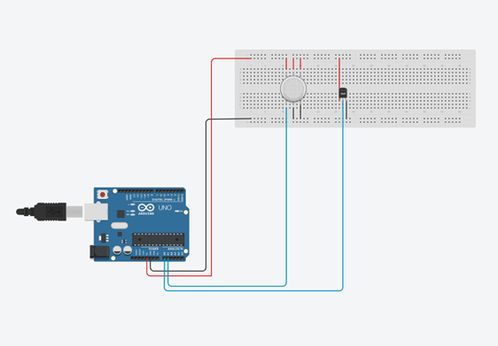
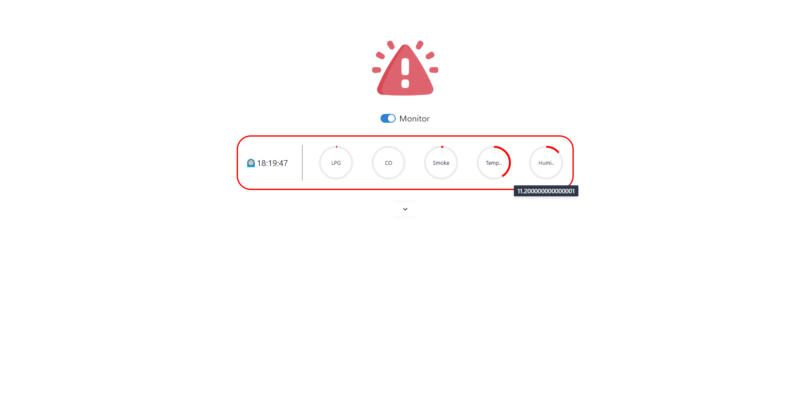
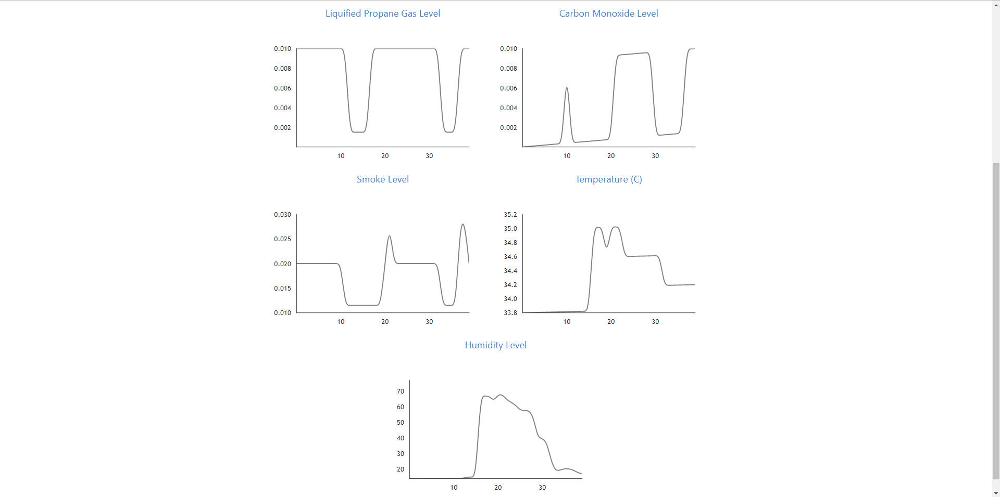
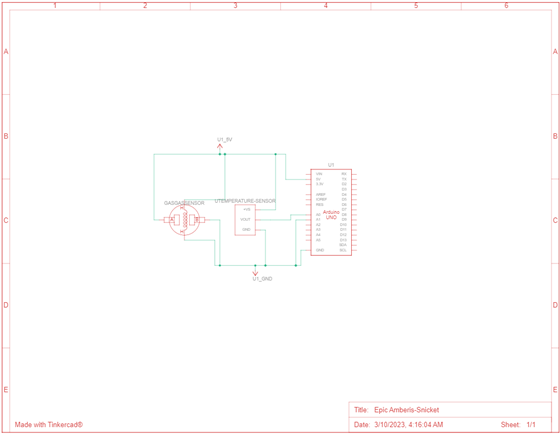

# fire-detector
>Fires are a major safety concern in homes and offices. Early detection of fires is critical for preventing property damage and saving lives. This project aims to build a fire detection system using gas and temperature sensors to predict when there is a fire or not.

>The system will use a gas sensor to detect the presence of liquified propane gas, carbon monoxide and smoke that typically hint fire hazard. Additionally, a temperature sensor will be used to detect abnormal temperature increases and humidity decreases.

>The readings from the sensors will be processed by an Arduino board that will be connected to a computer. A Python script will analyze the data, and machine learning algorithms will be used to develop a model that can predict the likelihood of a fire.

>The system includes a dashboard-like interface where the end-user can get alerts for detected fires and monitor the physical and chemical quantities around the environment.

# Built with
- [Arduino](https://arduino.cc)
- [MQ2 Gas Sensor](https://github.com/labay11/MQ-2-sensor-library)
- [DHT11 Temperature Sensor](https://www.arduinolibraries.info/libraries/dht-sensor-library)
- [sklearn](https://scikit-learn.org/)
- [Pynecone](https://pynecone.io/)

# Prerequisites

- [Node.js](https://nodejs.org/en/download) `12.22.0+`

# Usage
- Setup your arduino, breadboard and sensors as shown [here]()
- Upload this [sketch](fire-detector\Fire-Detector\Fire-Detector.ino) to the microcontroller using Arduino IDE or VS Code
- `pip install -r requirements.txt`
- `pc init`
- `pc run`

# Demo

# Project Diagram

# Schematic

